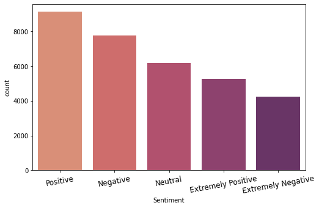

# Covid Tweets Sentiment Analysis
# Sentiment Analysis (Classification) of Tweets related to Covid-19 - Natural Language Processing

</br>
<p align="center"></p>
</br>

## About the project
Sentiment Analysis (NLP) is a process of analyzing a text to determine a text sentiment/emotion. In this project I used tweets related to Covid-19 to see people sentiment to the virus. 

#

### **Objective**
Classify/predicts tweets sentiment to the correct labels.

#

***jupyter notebook:***
** [covid_tweets](covid_tweets.ipynb)**

#

## Folder Structure
```
.
├── img/                                : contain image used
|   └── src.txt                         : link source for image
└── plot/                               : contain image file of plot 
└── .gitignore
└── covid_tweets.ipynb                  : jupyter notebook
└── README.md
```

#

## TABLE OF CONTENT
- [THE DATASET](#the-dataset)
- [TEXT CLEANING-TOKENIZING](#text-cleaning-tokenize)
- [MODEL](#model)
<br/>

#

## **THE DATASET**
Dataset include seperate train(40k) and test(3k) dataset, which contain features:
- UserName      : twitter username of tweet's poster (hidden by id)
- ScreenName    : twitter name of tweet's poster (hidden by id)
- Location      : location of tweet's posted
- TweetAt       : date of tweet
- OriginalTweet : the tweet
- Sentiment     : manual sentiment classification

Tweet's sentiment classified into 5 labels
(Positive, Negative, Neutral, Extremely Positive, Extremely Negative):
<p align="center"></p>

#

## **TEXT CLEANING-TOKENIZE**
General Text Cleaning for the tweets such as:
- removing unused character (emoji, hashtags, symbols/special character, extra spaces, enter)
- lowercase words.

For the words tokenizing, I used BertTokenizer
#

## **MODEL**
The model build with neural network tensorflow, with BERT pretrained model (TFBert).
</br>
Model Architecture:
<p align="center"></p>
</br>
Model results:
              precision    recall  f1-score   support

           0       0.79      0.87      0.82       425
           1       0.89      0.79      0.84       463
           2       0.76      0.77      0.77       774
           3       0.88      0.80      0.84       429
           4       0.76      0.80      0.78       694

       micro avg       0.80      0.80      0.80      2785
       macro avg       0.82      0.81      0.81      2785
    weighted avg       0.81      0.80      0.80      2785
    samples avg        0.80      0.80      0.80      2785

**Accuracy Score**: 80.10%
